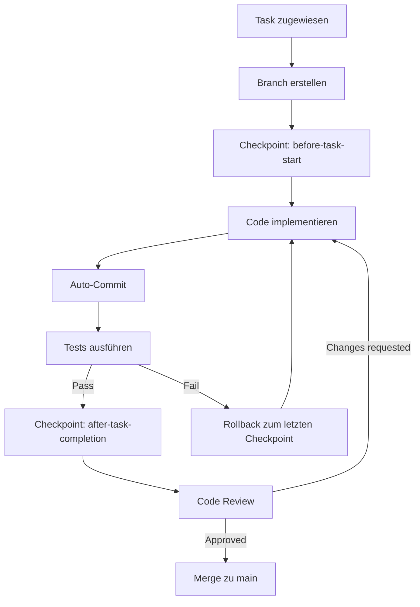

# Git-Workflow für Agent-Orchestrator

## Übersicht

Jeder Agent arbeitet auf seinem eigenen Git-Branch und committet regelmäßig seine Änderungen. Das System bietet automatisches Versioning, Rollback-Mechanismen und Test-Integration.

## Branch-Strategie

### Branch-Naming Convention

```
agent/{agentId}/{taskId}-{timestamp}
```

**Beispiele:**
- `agent/team-1-lead/T1.1.1-1704067200000`
- `agent/team-2-backend-1/T2.3.4-1704153600000`

### Workflow



## Features

### 1. Automatische Branch-Erstellung

Wenn ein Agent einen Task zugewiesen bekommt:

```typescript
// Automatisch beim assignTask():
const branch = await gitManager.createTaskBranch('team-1-lead', 'T1.1.1');
// Erstellt: agent/team-1-lead/T1.1.1-1704067200000
```

### 2. Checkpoints (Git Tags)

Checkpoints werden automatisch erstellt:

- **Before Task Start**: Vor Beginn der Arbeit
- **After Task Completion**: Nach erfolgreicher Implementierung
- **On Test Failure**: Bei fehlgeschlagenen Tests

```typescript
// Checkpoint erstellen:
await agent.createCheckpoint(task, 'before-task-start');
// Erstellt: checkpoint/T1.1.1/1704067200000
```

### 3. Auto-Commit

Commits werden automatisch erstellt mit detaillierten Informationen:

```
[T1.1.1] Organisation-Model & Migration implementiert

Agent: Team 1 Lead Agent (team-1-lead)
Task: T1.1.1

🤖 Generated with Claude Agent Orchestrator
```

### 4. Test-Integration

Commits können mit automatischer Test-Validierung durchgeführt werden:

```typescript
// Commit nur wenn Tests erfolgreich:
const success = await agent.commitWithTests(
  task,
  'User-Model implementiert',
  'php artisan test --filter=UserModelTest'
);

// Bei Test-Failure: Automatischer Rollback!
```

### 5. Rollback-Mechanismus

Bei Fehlern automatischer Rollback zum letzten stabilen Zustand:

```typescript
// Automatisch bei executeTask() Error:
await agent.rollbackTask(task);

// Oder manuell:
await gitManager.rollback('checkpoint/T1.1.1/before-task-start');
```

### 6. Merge zu Main

Nach erfolgreicher Code-Review:

```typescript
// Automatisch bei completeTask():
await gitManager.mergeToMain(branchName, taskId);
// Merge mit --no-ff Flag für saubere History
```

## Konfiguration

In `config/orchestrator.json`:

```json
{
  "git": {
    "enabled": true,
    "branchPerAgent": true,
    "autoCommit": true,
    "commitFrequency": "per-file",
    "testBeforeCommit": true,
    "testCommand": "php artisan test --filter",
    "autoMerge": false,
    "requireCodeReview": true,
    "checkpoints": {
      "enabled": true,
      "createBeforeTask": true,
      "createAfterTask": true
    },
    "rollback": {
      "enabled": true,
      "autoRollbackOnTestFailure": true,
      "autoRollbackOnError": true
    }
  }
}
```

## Commit-Strategie

### Option 1: Per-File Commits

Jede Datei wird separat committet:

```
✓ [T1.1.1] Created migration: create_organisations_table
✓ [T1.1.1] Created model: Organisation
✓ [T1.1.1] Created factory: OrganisationFactory
✓ [T1.1.1] Created tests: OrganisationTest
```

### Option 2: Per-Task Commits

Alle Änderungen eines Tasks in einem Commit:

```
✓ [T1.1.1] Organisation-Model & Migration komplett
```

## Git-Historie

Beispiel Git-Log:

```bash
* d4f3a21 (agent/team-1-lead/T1.1.3-xxx) [T1.1.3] Multi-Tenancy Architecture Design
|           Agent: Team 1 Lead Agent
|           - Architecture diagram
|           - Tenant isolation strategy
|           - Migration strategy
|
* b2e1c09 [T1.1.2] Filament Installation completed
|           Agent: Team 1 Lead Agent
|           - Filament v4 installed
|           - Admin panel configured
|
* a1d4f78 [T1.1.1] Organisation-Model & Migration
            Agent: Team 1 Lead Agent
            - Migration: create_organisations_table
            - Model: Organisation with relations
            - Factory & Tests
```

## Checkpoint-System

### Checkpoint-Typs

| Type | Tag Format | Wann |
|------|-----------|------|
| Before Task | `checkpoint/{taskId}/before-{timestamp}` | Vor Task-Start |
| After Task | `checkpoint/{taskId}/after-{timestamp}` | Nach Task-Completion |
| Pre-Test | `checkpoint/{taskId}/pre-test-{timestamp}` | Vor Test-Ausführung |
| Stable | `checkpoint/{taskId}/stable-{timestamp}` | Nach erfolgreichen Tests |

### Rollback zu Checkpoint

```bash
# Liste alle Checkpoints
git tag -l "checkpoint/T1.1.1/*"

# Rollback zum Checkpoint
git reset --hard checkpoint/T1.1.1/before-1704067200000

# Via GitManager:
await gitManager.rollback('checkpoint/T1.1.1/stable-1704067200000');
```

## Code-Review-Integration

### Workflow

1. Agent erstellt Branch & implementiert Task
2. Agent commitet regelmäßig
3. Nach Task-Completion: Branch bereit für Review
4. Code-Review-Agent prüft:
   - Code-Quality
   - Best Practices
   - Test-Coverage
   - Security
5. Bei Approval: Merge zu `main`
6. Bei Changes: Agent arbeitet weiter auf Branch

### Code-Review-Trigger

```typescript
// Nach Task-Completion:
if (config.git.requireCodeReview) {
  await sendToCodeReviewAgent(task, branchName);
  // Warte auf Approval...
}
```

## Best Practices

### 1. Häufig committen

✅ **Gut:**
```
✓ Migration erstellt
✓ Model erstellt
✓ Factory erstellt
✓ Tests erstellt
```

❌ **Schlecht:**
```
✓ Alles fertig
```

### 2. Aussagekräftige Commit-Messages

✅ **Gut:**
```
[T1.1.1] Organisation-Model mit Tenant-Relations erstellt

- slug für URL-friendly IDs
- settings JSON für flexible Konfiguration
- cascading deletes für Tenant-Isolation
```

❌ **Schlecht:**
```
[T1.1.1] stuff
```

### 3. Tests vor Merge

Immer Tests ausführen vor Merge zu `main`:

```typescript
const testsPassed = await agent.commitWithTests(
  task,
  'Ready for merge',
  'php artisan test'
);

if (testsPassed) {
  await gitManager.mergeToMain(branch, taskId);
}
```

## Troubleshooting

### Merge-Konflikte

Bei Merge-Konflikten:

1. Agent stopt automatisch
2. Sendet Nachricht an Orchestrator
3. Orchestrator assignt Conflict-Resolution-Task
4. Agent löst Konflikte manuell (mit Human-Approval)

### Fehlgeschlagene Tests

Bei Test-Failure:

1. Auto-Rollback zum letzten Checkpoint
2. Agent analysiert Fehler
3. Agent implementiert Fix
4. Tests erneut ausführen

### Verlorene Änderungen

Alle Änderungen sind via Git wiederherstellbar:

```bash
# Git reflog zeigt alle Änderungen
git reflog

# Wiederherstellen
git reset --hard HEAD@{5}
```

## Beispiel-Workflow

### Schritt-für-Schritt

```typescript
// 1. Task Assignment
await agent.assignTask(task);
// ✓ Created branch: agent/team-1-lead/T1.1.1-1704067200000

// 2. Checkpoint before start
await agent.createCheckpoint(task, 'before-task-start');
// ✓ Created checkpoint: checkpoint/T1.1.1/before-1704067200000

// 3. Implementierung
// ... Code schreiben ...

// 4. Commit mit Tests
const success = await agent.commitWithTests(
  task,
  'Organisation-Model implementiert',
  'php artisan test --filter=OrganisationTest'
);
// ✓ Changes committed and tests passed

// 5. Checkpoint after completion
await agent.createCheckpoint(task, 'after-task-completion');
// ✓ Created checkpoint: checkpoint/T1.1.1/after-1704067200000

// 6. Task Completion
await agent.completeTask(task);
// ✓ Merged task T1.1.1 to main
// ✓ Deleted branch: agent/team-1-lead/T1.1.1-1704067200000
```

## Monitoring

### Git-Metriken im Dashboard

Das Dashboard zeigt:
- Anzahl Commits pro Agent
- Anzahl Rollbacks
- Test Success Rate
- Merge Frequency
- Code Review Status

### CLI-Commands

```bash
# Git-Status aller Agents
npm run start -- git:status

# Git-Historie eines Agents
npm run start -- git:history team-1-lead

# Aktive Branches
npm run start -- git:branches

# Checkpoints anzeigen
npm run start -- git:checkpoints T1.1.1
```

## Sicherheit

### Automatische Backups

- Alle Commits sind dauerhaft in Git gespeichert
- Checkpoints als Tags niemals gelöscht
- Reflog aktiviert (min. 90 Tage)

### Rollback-Schutz

- Rollback nur zu bekannten Checkpoints
- Keine force-pushes zu `main`
- Merge nur nach Code-Review

### Audit-Trail

Vollständige Git-Historie als Audit-Log:
- Wer hat was geändert
- Wann wurde geändert
- Warum (Commit-Message mit Task-ID)

---

**Zusammenfassung**: Jeder Agent arbeitet sicher auf seinem eigenen Branch, committet regelmäßig mit automatischen Tests, und kann jederzeit zu einem stabilen Zustand zurückkehren. 🎯
